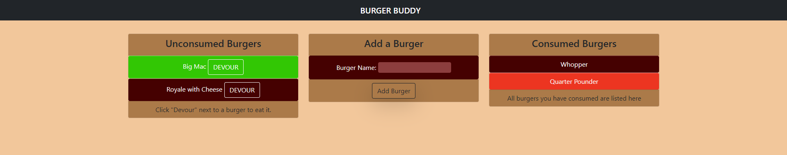

# Burger Buddy

## Description

Application that will allow a user to list burgers they want to eat, and then mark individual burgers as consumed from that list.  Takes in user input to add burgers and mark burgers as consumed.  Programmed in HTML (Using Handlebars), CSS (with Bootstrap), and JavaScript.  Data stored in MySQL. Uses express, express-handlebars, and mysql packages.  Deployed on Heroku using JawsDB.

Deployed Site: [https://serene-lowlands-21111.herokuapp.com/](https://serene-lowlands-21111.herokuapp.com/)

## Table of Contents
* [Installation])(#installation)
* [Usage](#usage)
* [License](#license)
* [Contributing](#contributing)
* [Tests](#tests)
* [Questions](#questions)

##  Installation

* Fork from the GitHub Repository: [https://github.com/Udunomancer/gt-ft-burger-buddy](https://github.com/Udunomancer/gt-ft-burger-buddy)
* Ensure that node is available on device.
* Install packages, and run schema files to begin local deployment.

##  Usage

* The program should allow a user to open a new page by navigating to [https://serene-lowlands-21111.herokuapp.com/](https://serene-lowlands-21111.herokuapp.com/)
* When the user enters a new burger, it should be displayed in the burgers to be consumed section.
* Once a burger is consumed, it should be displayed in the consumed burgers section.

##  License

[The MIT License](https://opensource.org/licenses/MIT)

##  Contributing

No public contributions accepted in this repository at this time.
If issues are found, please contact me using email/GitHub profile found in the Questions section below.

##  Tests

To confirm functionality:
* Enter burgers and confirm they appear in the To Be Consumed section.
* Consume burgers and confirm they appear in the Consumed section.

##  Questions

Have questions?
* View my GitHub Profile: [https://github.com/Udunomancer](https://github.com/Udunomancer)
* Email me at: [kyle717@gmail.com](mailto:kyle717@gmail.com)